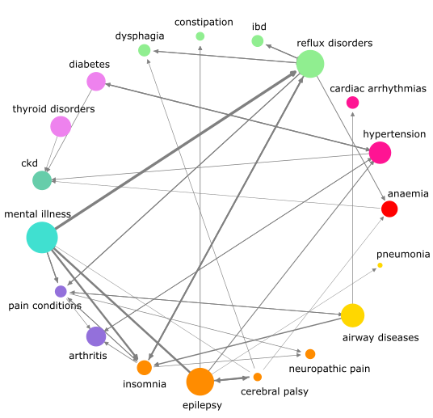
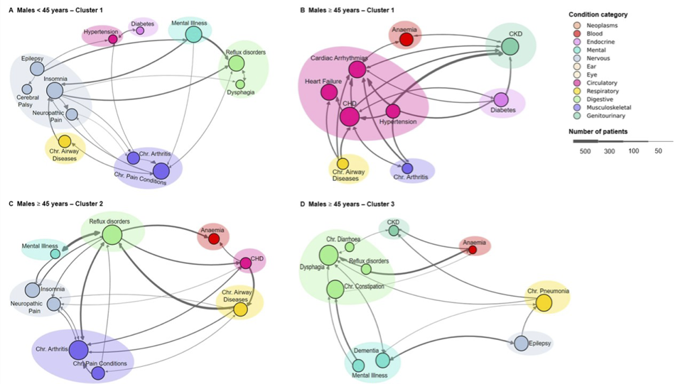
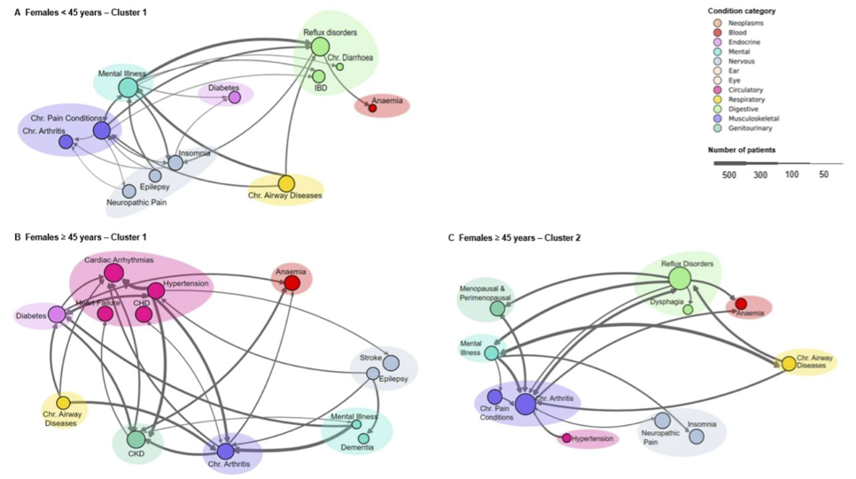

# DECODE-DiseaseTrajectories

## Overview

DECODE-DiseaseTrajectories is a Python package that provides a framework to analyse temporal associations between disease pairs and disease trajectories from Electronic Health Records. It identifies statistically significant disease pairs and determines their temporal directionality through statistical testing. The package then constructs disease trajectories by connecting these significant pairs in sequence and employs a shortest-path graph-based clustering method to group similar disease patterns. 

The methodology was presented in the article [*"Temporal Patterns of Multiple Long-Term Conditions in Welsh Individuals with Intellectual Disabilities: An Unsupervised Clustering Approach to Disease Trajectories"*](https://www.frontiersin.org/journals/digital-health/articles/10.3389/fdgth.2025.1528882/abstract). This repository also provides code to reproduce the experiments and visualisations there. If you use this code, please cite the paper:

Kousovista, R., Cosma, G., Abakasanga, E., Akbari, A., Zaccardi, F., Jun, G. T., Kiani R. & Gangadharan, S. (2025). Temporal Patterns of Multiple Long-Term Conditions in Welsh Individuals with Intellectual Disabilities: An Unsupervised Clustering Approach to Disease Trajectories. *Frontiers in Digital Health*, 7, 1528882.

```bibtex
@article{kousovista2025temporal,
  title={Temporal Patterns of Multiple Long-Term Conditions in Welsh Individuals with Intellectual Disabilities: An Unsupervised Clustering Approach to Disease Trajectories},
  author={Kousovista, Rania and Cosma, Georgina and Abakasanga, Emeka and Akbari, Ashley and Zaccardi, Francesco and Jun, Gyuchan Thomas and Kiani, Reza and Gangadharan, Satheesh},
  journal={Frontiers in Digital Health},
  volume={7},
  pages={1528882},
  year={2025}
}
```

## Installation

```bash
git clone https://github.com/raniakous/DECODE-DiseaseTrajectories.git
cd DECODE-DiseaseTrajectories
pip install -e .
```

## Requirements

- Python >= 3.8
- numpy >= 1.20.0
- pandas >= 1.3.0
- scipy >= 1.7.0
- scikit-learn >= 1.0.0
- networkx >= 2.6.0
- matplotlib >= 3.4.0
- seaborn >= 0.11.0

## Analysis Workflow

The package implements a complete workflow for disease trajectory analysis:

### 1. Temporal Pairs Analysis

This stage identifies statistically significant pairs of diseases that occur together more frequently than expected by chance:

- Process patient-level disease occurrence data
- Identify patients with common diseases
- Perform Fisher's exact test to identify significant disease pairs
- Apply Bonferroni correction to control for multiple testing
- Determine directionality using binomial test
- Output significant disease pairs with temporal direction



### 2. Trajectory Construction

Using the significant pairs from the previous stage:

- Connect disease pairs to form trajectories
- Construct trajectories of varying lengths (typically length 3 and 4)
- Filter out trajectories with repeated diseases

### 3. Network-Based Clustering

Group similar trajectories together using network-based similarity:

- Construct a network graph from trajectories
- Calculate similarity between diseases using shortest path distances
- Generate similarity matrices between trajectories
- Determine optimal number of clusters
- Perform spectral clustering to identify trajectory clusters





### 4. Visualization

Several visualization methods are available:

- Disease pair networks (coloured by system category)
- Cluster-specific network visualizations
- Interactive network graphs of disease relationships

Users can customize the visualizations by modifying the `utils.py` file to define their own system categories and colors. The file contains mappings between diseases and body systems (`system_mapping`) and system colors (`systems_colors`) that can be adjusted to suit specific research needs or to match institutional color schemes.

## Usage Example

```python
from disease_trajectories.pairs_analysis import TemporalPairs
from disease_trajectories.shortest_path_network import ShortestPath
import pandas as pd

# Load patient data
patient_df = pd.read_csv("patient_data.csv")

# Perform temporal pairs analysis
pairs_obj = TemporalPairs(patient_df)

# Get significant disease pairs and trajectories
pairs_df = pairs_obj.final_pairs_df
trajectory_df = pairs_obj.trajectories_df_length_3

# Visualize disease pairs network
pairs_obj.pair_plot()

# Perform network-based clustering
shortest_path_obj = ShortestPath(trajectory_df)
cluster_result_df = shortest_path_obj.perform_clustering(optimal=True)

# Visualize a specific cluster
shortest_path_obj.cluster_network_plot(
    trajectory_df=cluster_result_df,
    pairs_df=pairs_df,
    cluster_to_plot=0,
    percentage_threshold_to_drop=1,
    network_radius=11.5,
    edge_prc_to_drop=0.01,
)
```

## Input Data Format

The package expects longitudinal patient data with the following columns:

- `patient_id`: Unique identifier for each patient
- `date`: Date of diagnosis (YYYY-MM-DD format)
- `disease`: Name of the disease

## Output Data

The analysis produces:

- `final_pairs_df`: DataFrame of significant disease pairs with directionality
- `trajectories_df_length_3`: DataFrame of three-disease trajectories
- `trajectories_df_length_4`: DataFrame of four-disease trajectories (if available)
- Cluster assignments for each trajectory

## License

MIT License

## Contact

For questions or support, please contact [r.kousovista@lboro.ac.uk] or submit an Issue on GitHub.
